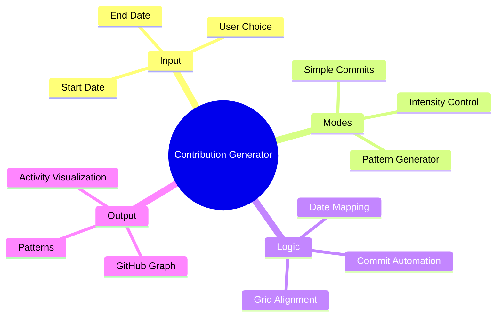
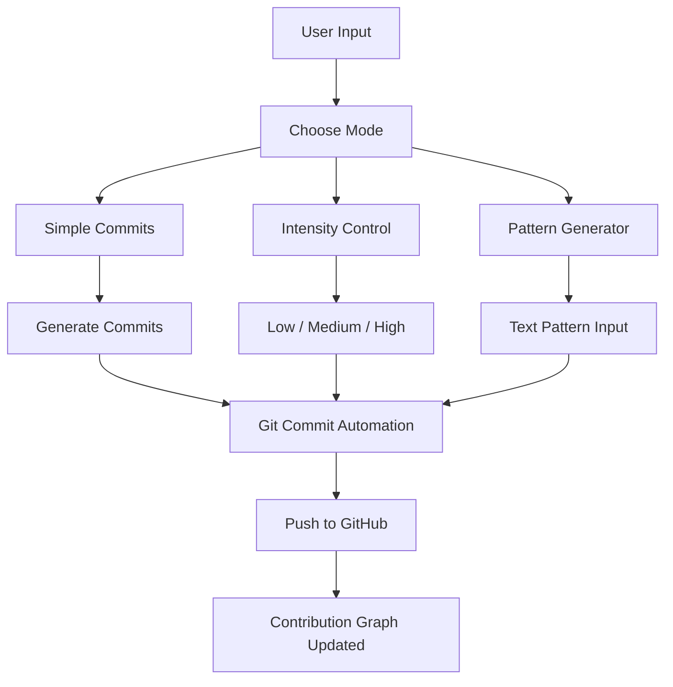

# 🧠 GitHub Contribution Generator

> 🚀 Generate **custom GitHub contribution graphs** with automation, patterns & intensity control
> Built using **Python + Git Automation + CLI Interface**

---


---

## 📛 Badges


---

## 🧠 Project Mindmap



---

## 🔄 Workflow



---

## 📂 Project Structure

```
github-contribution-generator/
│
├── activity.py        ← Main CLI script
├── data.txt           ← Commit data storage
├── README.md          ← Project documentation
│
└── assets/
    └── demo.gif       ← (optional demo)
```

---

## ⚡ Features

* 📅 Custom Date Range Commits
* 🔁 Backdated Commit Automation
* 🎯 Intensity Control (Low / Medium / High)
* 🔤 Pattern Generator (A–Z, 0–9 supported)
* 🧠 Grid-based Graph Mapping
* ⚡ Fully CLI-based interaction
* 🚀 Instant GitHub Graph Update

---

## 🛠 Tech Stack

* Python
* Git CLI
* GitHub API (indirect via commits)
* OS Automation

---

## 🚀 Quickstart

### 1️⃣ Clone Repository

```bash
git clone https://github.com/Avinraj01/Github-Activity-Generator.git
cd Github-Activity-Generator
```

---

### 2️⃣ Run Script

```bash
python3 activity.py
```

---

### 3️⃣ Choose Mode

```text
1 → Simple commits  
2 → Intensity control  
3 → Pattern generator  
```

---

### 4️⃣ Provide Input

```text
Start Date → YYYY-MM-DD  
End Date → YYYY-MM-DD  
Text (for pattern) → AVIN / HELLO / 2026  
```

---

## 📊 Output

* 🌱 Fully green contribution graph
* 🔤 Custom text patterns in graph
* 📈 Controlled commit intensity
* ⚡ Automated GitHub updates

---

## 🎯 Example Patterns

```
AVIN
 ███    █   █   ███   █   █
█   █   █   █    █    ██  █
█████   █   █    █    █ █ █
█   █    █ █     █    █  ██
█   █     █     ███   █   █
```

---

## ⚠️ Disclaimer

> This project is intended for **learning and demonstration purposes only**.
> Do not misuse fake activity for misleading representation.

---

## 🤝 Contributing

1. Fork this repo
2. Create branch (`git checkout -b feature-name`)
3. Commit (`git commit -m "Add feature"`)
4. Push (`git push origin feature-name`)
5. Open Pull Request 🚀

---

## 🧠 Future Improvements

* 🎯 Perfect centered pattern alignment
* 🌐 Web UI (React / Streamlit)
* 📊 Live preview before commit
* 🤖 AI-based pattern generation
* ☁️ GitHub Actions automation

---

## 📜 License

MIT License

---

✨ *Automate. Visualize. Dominate your GitHub graph.* ✨
